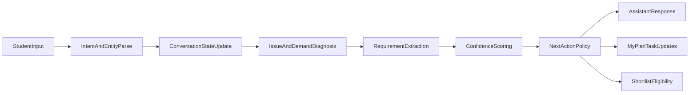

# Student Conversation Engine Phase 2 Specification

## Purpose

Define the conversation intelligence layer that turns student dialogue into reliable admissions requirements and actionable next steps.

This spec operationalizes Phase 1 UX principles into:
- question bank structure
- adaptive branching rules
- requirement extraction schema
- confidence and missing-data logic
- handoff contracts to shortlist and application experiences

## Scope

Included:
- Conversation turn model and lifecycle
- Diagnostic domains and prompt sets
- Branching strategy and re-entry behavior
- Requirement normalization and storage schema
- Confidence scoring and release thresholds
- Explainability and editability requirements
- Event instrumentation for analysis and optimization

Excluded:
- Final model/provider implementation details
- Production prompt tuning and localization
- Institution-side conversation workflows

## Conversation Engine Architecture

## Core Design Principles

- **Conversation-first, not form-first:** use forms only when precision is required.
- **Progressive certainty:** collect minimum useful data first, then deepen by risk.
- **Student control:** every inferred requirement is visible and editable.
- **Transparent reasoning:** recommendation eligibility depends on visible confidence.
- **No dead ends:** every response path provides a next action.

## State Model

## Conversation Session

- `session_id`
- `student_id`
- `current_stage`: `understand_context | identify_issues | define_demand | translate_requirements | ready_for_shortlist`
- `active_domain`: current domain focus
- `turn_count`
- `last_summary`
- `last_updated_at`

## Diagnostic Domains

- `academic_readiness`
- `budget_finance`
- `country_location`
- `timeline_intake`
- `career_outcome`
- `eligibility_compliance` (tests, language, visa, prerequisites)
- `learning_preferences` (optional)

## Per-Domain State

- `status`: `unknown | partial | sufficient | conflicting`
- `confidence`: 0-100
- `missing_fields`: string[]
- `conflicts`: string[]
- `last_confirmed_at`

## Question Framework

## Question Types

- `open_reflection`: broad intent capture
- `structured_choice`: force tradeoff clarity
- `numeric_constraint`: budget, score, timeline
- `evidence_request`: verify uncertain claims
- `confirmation`: approve or edit inferred summary

## Prompt Template Contract

Each prompt must include:
- `why_asked`: why this question matters now
- `question_text`
- `expected_answer_shape`: free text / option / number / date
- `impact_hint`: what improves after answering
- `skip_option`: always available where safe

## Phase 2 Baseline Question Bank

### Understand Context

- "What are you aiming for after graduation?"
- "What programs are you currently considering, if any?"
- "What worries you most about applying?"

### Budget and Finance

- "What annual tuition range is realistic for you?"
- "How important is scholarship support?"
- "Would you consider lower-cost regions for similar outcomes?"

### Timeline and Intake

- "Which intake are you targeting?"
- "What is your latest acceptable application deadline?"
- "How much preparation time can you commit weekly?"

### Eligibility and Readiness

- "What are your current GPA/test/language scores?"
- "Which requirements are still missing?"
- "Do you have any visa or residency constraints?"

### Demand Confirmation

- "Here is what I understood as your must-haves. What should I change?"
- "Which tradeoff is acceptable: lower cost, later intake, or lower ranking?"

## Branching and Policy Rules

## Branch Trigger Categories

- `insufficient_data`: key domain unknown
- `low_confidence`: domain confidence below threshold
- `conflict_detected`: contradictory constraints
- `high_urgency`: deadline risk
- `shortcut_entry`: came from Discover without diagnosis

## Policy Matrix

| Condition | Policy |
|---|---|
| insufficient_data + low_urgency | Ask one focused follow-up in active domain |
| insufficient_data + high_urgency | Switch to feasibility-first prompts |
| conflict_detected | Show explicit tradeoff card, require user choice |
| low_confidence persistent (3 turns) | Offer structured mini-form fallback |
| shortcut_entry | Continue flow, but inject requirement completion nudges |

## Re-entry Rules

- Student may jump from `Programs` to guided diagnosis without losing context.
- Any profile/document update triggers selective re-evaluation of affected domains.
- Requirement changes invalidate outdated shortlist rationale and request re-confirmation.

## Requirement Extraction Schema

## Canonical Requirement Object

- `requirement_id`
- `domain`
- `field`
- `value`
- `priority`: `must_have | should_have | optional`
- `source`: `student_explicit | inferred | imported`
- `confidence`: 0-100
- `status`: `draft | confirmed | rejected`
- `evidence_turn_ids`: string[]
- `updated_at`

## Domain Field Examples

- `budget_finance.max_annual_tuition`
- `timeline_intake.target_intake`
- `eligibility_compliance.language_test_min`
- `country_location.allowed_countries`
- `career_outcome.primary_goal`

## Conflict Model

- `conflict_id`
- `fields_in_conflict`
- `reason`
- `resolution_options`
- `selected_resolution`

## Confidence Scoring

## Scoring Dimensions

- **Coverage (40%)**: required fields completed per domain
- **Consistency (25%)**: absence of unresolved conflicts
- **Evidence quality (20%)**: explicit and recent confirmations
- **Temporal validity (15%)**: freshness of time-sensitive data

## Confidence Levels

- `0-39`: insufficient (no shortlist recommendation)
- `40-69`: provisional (limited shortlist with warnings)
- `70-84`: recommendation-ready (standard shortlist)
- `85-100`: high-confidence (full reasoning and stronger ranking signal)

## Threshold Policies

- Minimum global confidence for shortlist release: `>= 70`
- Minimum domain confidence for budget/timeline/eligibility: `>= 65`
- Any unresolved hard conflict blocks "final shortlist lock"

## Explainability Contract

For every recommended program, include:
- matched requirements
- unmet or uncertain requirements
- confidence level and what can improve it
- top reason code list (`cost_fit`, `deadline_fit`, `eligibility_fit`, etc.)

For every inferred requirement, include:
- inference source turn(s)
- editable value control
- accept/reject action

## Conversation Outputs and Handoffs

## Output Bundles

- `student_intent_summary`
- `issue_clusters`
- `requirement_set` (draft + confirmed)
- `confidence_report`
- `next_best_actions`

## Downstream Consumers

- `MyPlan`: next tasks, blockers, urgency
- `Programs/Shortlist`: fit/rationale generation
- `Applications`: checklist prefill and readiness gating

## Failure and Recovery Handling

- If parser confidence is low: ask clarifying question with examples.
- If repeated ambiguity: switch to guided structured inputs.
- If student frustration signals detected: summarize progress, offer two clear next options.
- If no response timeout: send resumable checkpoint summary.

## Instrumentation and Analytics Events

- `conversation_started`
- `domain_entered`
- `question_asked`
- `answer_received`
- `requirement_inferred`
- `requirement_confirmed`
- `requirement_rejected`
- `conflict_detected`
- `conflict_resolved`
- `confidence_updated`
- `shortlist_unlocked`
- `shortcut_reentry_started`
- `dropoff_risk_flagged`

Each event should include:
- `student_id`
- `session_id`
- `stage`
- `domain`
- `confidence_before`
- `confidence_after`
- `timestamp`

## Acceptance Criteria (Phase 2)

- Engine can progress from open chat input to confirmed requirement set.
- Branching logic handles insufficiency, urgency, and conflicts deterministically.
- Confidence score updates after every relevant turn.
- Shortlist release gate is enforced by confidence + conflict rules.
- Student can inspect and edit all inferred requirements.
- Conversation state is resumable across sessions and entry points.

## Implementation Notes (Non-binding)

- Start with rules-first orchestration; layer model improvements after telemetry.
- Keep domain extraction contracts versioned for backward compatibility.
- Prefer explicit reason codes over opaque free-text internal state.

