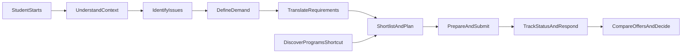

# Student Conversation-First Admission UX Flow Map (Phase 1 Artifact)

## Purpose

Define the student-side UX foundation where conversation and need diagnosis drive the admission journey. Program discovery remains available as a shortcut, but the primary path is understanding the student first.

## Phase 1 Objectives

- Establish a conversation-first journey from intent discovery to requirement confirmation.
- Support two entry modes: guided diagnosis and `DiscoverPrograms` shortcut.
- Define IA that keeps "what is next" and "what is missing" visible at all times.
- Set trust rules for explainability, editable AI inference, and urgency clarity.
- Identify top abandonment risks with concrete UX mitigation patterns.

## Student Problem Model

### Signal Layers

- **StatedWants:** What students explicitly say (e.g., "top school in US").
- **InferredNeeds:** What system infers from context (e.g., scholarship pressure, visa risk, timeline tightness).
- **HardConstraints:** Non-negotiables (budget cap, test requirements, intake date, language eligibility).

### Core Underlying Issue Taxonomy

- **ClarityGap:** Student cannot define target program profile.
- **ConfidenceGap:** Student doubts competitiveness or readiness.
- **AffordabilityRisk:** Budget and funding feasibility uncertain.
- **EligibilityUncertainty:** Requirements unclear (test, GPA, documents, visa, prerequisites).
- **TimelinePressure:** Deadlines too close for current readiness.
- **OutcomeAmbiguity:** Career outcome goals are vague or conflicting.

## Journey Stages (Conversation-First)

| Stage | Student Goal | System Goal | Entry Criteria | Exit Criteria |
|---|---|---|---|---|
| UnderstandContext | Tell story and goals | Build baseline profile context | Student enters chat or onboarding | Core profile context captured |
| IdentifyIssues | Surface hidden blockers | Detect issue taxonomy and urgency | Baseline context exists | At least one issue cluster with confidence |
| DefineDemand | Clarify outcomes and tradeoffs | Convert goals into demand statements | Issues identified | Ranked priorities acknowledged by student |
| TranslateRequirements | Create actionable criteria | Build must-have/should-have constraints | Demand statements exist | Requirements confirmed by student |
| ShortlistAndPlan | See feasible options | Generate rationale-backed shortlist | Requirements confirmed OR shortcut entry | Student saves shortlist + next action plan |
| PrepareAndSubmit | Complete applications | Orchestrate checklist and deadlines | Shortlist or selected program exists | Application submitted or paused with plan |
| TrackStatusAndRespond | Stay in control post-submit | Show status, requests, urgency | At least one active application | Required actions completed on time |
| CompareOffersAndDecide | Make final decision | Support side-by-side decisioning | At least one outcome exists | Commit, defer, or reapply pathway selected |

## Core Flow Architecture

## Task Flows

### Guided Mode (Primary)

1. Student enters chat.
2. System runs progressive diagnosis prompts.
3. System summarizes inferred needs and hard constraints.
4. Student edits/approves requirement draft.
5. System returns shortlist with transparent rationale.
6. Student chooses programs and starts applications.

### Shortcut Mode (`DiscoverPrograms`)

1. Student searches directly in Programs.
2. Student saves programs / starts application.
3. System shows persistent "Improve fit by confirming requirements" prompt.
4. Student can re-enter guided diagnosis at any time.

### Recovery Loops

- Change destination country / degree level.
- Tight deadline mode (prioritize feasible, near-term options).
- Pause and resume with continuity summary.
- Re-open requirement draft after new score/doc update.

## Edge Cases and Non-Linear Behavior

| Edge Case | UX Handling |
|---|---|
| Student gives vague answers | Prompt with examples + forced preference ranking |
| Student conflicts self (e.g., low budget + high-cost only) | Tradeoff card with explicit consequence choices |
| Missing critical requirement data | "Unknowns" panel with confidence impact and CTA |
| Late deadline discovery | Urgency rail + narrowed feasible shortlist |
| Shortcut-only user avoids diagnosis | Non-blocking nudges, then progressive hard-gates at submit readiness |

## Information Architecture Baseline

## Top-Level Navigation

- `MyPlan` (primary)
- `Programs`
- `Applications`
- `Messages`
- `Offers`
- `Profile`

## IA Principles

- `MyPlan` is the source of truth for intent, requirements, and next actions.
- Every page must show urgency context (deadlines/blockers).
- Conversation output is editable and auditable.

## Core Object Model (UX-facing)

- `StudentIntent`: goals, motivations, outcomes.
- `IssueCluster`: underlying issue categories with confidence.
- `Requirement`: must-have/should-have constraints.
- `Program`: candidate option with fit rationale.
- `Application`: progress state + required actions.
- `Offer`: outcome, cost, aid, conditions, response deadline.

## Global UI Rails (Always Visible or One Click Away)

- **UrgencyRail:** upcoming deadlines, overdue tasks.
- **BlockerRail:** missing requirements/documents.
- **ConfidenceMeter:** recommendation confidence and unknowns.
- **SupportRail:** contextual help, escalation, and fallback actions.

## Stage-Level UX Requirements

### UnderstandContext

- Conversational starter with reflective summary.
- Editable profile snapshot generated from dialogue.
- Immediate "what we still need" prompts.

### IdentifyIssues

- Issue chips with confidence indicators.
- Ability to accept/reject inferred issues.
- Explainable "why this issue was inferred."

### DefineDemand

- Priority ranking interaction (career outcome, location, budget, timeline).
- Tradeoff simulator for conflicting priorities.
- "If you choose X, expect Y" clarity statements.

### TranslateRequirements

- Must-have vs should-have split.
- Missing-field detector and completion nudges.
- Requirement lock/confirm step before shortlist finalization.

### ShortlistAndPlan

- Fit rationale per program (what matches, what is missing).
- Plan card: next steps, documents, deadline sequence.
- Shortcut users see requirement completion impact.

### PrepareAndSubmit

- Checklist with prerequisites and dependencies.
- Autosave, validation, and progress confidence indicators.
- Submit readiness status with blocker explanations.

### TrackStatusAndRespond

- Status timeline with clear action CTA per status.
- Countdown for requests and response deadlines.
- Message templates for institution communications.

### CompareOffersAndDecide

- Side-by-side offer comparison with cost/aid normalization.
- Condition visibility (deposit, expiry, requirements).
- Decision helper with student-priority scoring overlay.

## Trust, Explainability, and Clarity Rules

- Every recommendation answers: **why shown**, **what matched**, **what missing**.
- Every screen answers: **what to do next**, **how urgent**, **what outcome follows**.
- AI inference is never hidden; student can edit, reject, or re-run interpretation.
- Confidence is shown explicitly and linked to missing information.

## Top 5 Abandonment Risks and Mitigations

| Risk | Likely Trigger | Mitigation Pattern |
|---|---|---|
| Overwhelm at start | Too many questions early | Progressive disclosure + quick-start presets |
| Loss of trust in recommendations | Opaque match scoring | Fit rationale panel + editable assumptions |
| Drop-off during requirement completion | Friction and unclear benefit | "Why this matters" inline + immediate fit delta preview |
| Delay due to deadline anxiety | Hidden urgency | Persistent urgency rail + critical-path CTA |
| Shortcut users stall later | Skipped diagnosis debt | Soft nudges -> targeted hard-gates near submission |

## Assumptions

- Students accept a chat-first primary interaction.
- Requirement confirmation can be mandatory before final shortlist locking.
- Data confidence can be computed at field and stage level.
- Discovery shortcut remains available but not dominant.

## Open Questions

- Which fields are mandatory to unlock initial shortlist quality?
- How strict should hard-gates be for shortcut users before submission?
- What is the acceptable confidence threshold for recommendation release?
- Should urgency rails be global fixed elements or contextual drawers?

## Validation Checklist (Phase 1)

- One guided end-to-end path is fully specified with stage IO.
- One shortcut path is fully specified with re-entry points.
- Requirement confirmation exists before shortlist lock.
- Each stage has explicit user goal, system goal, and success signal.
- Top 5 abandonment risks mapped to concrete mitigations.
- Student can always answer: what is next, what is missing, how urgent.

