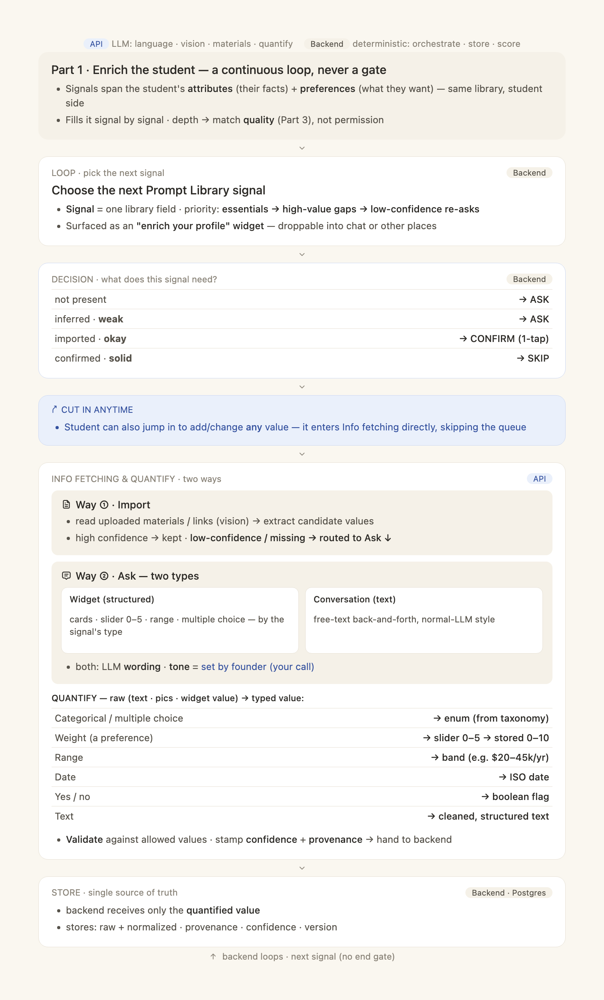

# AI Structure · Spec 1 of 3 — Profile Enrichment Engine (student side)

> **Part 1 of the three-part "AI Structure" architecture.** Sibling specs:
> - Spec 2 — School / Program Profile (`2026-06-17-ai-structure-2-school-program-profile-design.md`)
> - Spec 3 — Match Engine (`2026-06-17-ai-structure-3-match-engine-design.md`)
>
> All three ride **one shared Prompt Library**. This spec owns the student side of it.
> This document is **self-contained**: every field, type, confidence rule, endpoint, flag, and task needed to build Part 1 is written here — no need to fetch other docs.



---

**Goal:** Turn the student's profile into a continuously-enriched, fully-quantified set of Prompt-Library signals — acquired by import or by asking, each typed, validated, and stamped with confidence + provenance — so the Match Engine (Spec 3) always has the best data it can.

**Architecture:** A backend-orchestrated loop with an API (LLM) quantification layer. The **backend** (deterministic) decides what to ask next, stores values, and never sees raw language. The **API** (LLM — language, vision, materials) does all reading, asking, and the raw→typed quantification, handing the backend only quantified values. Enrichment is a **loop, never a gate**: depth affects match *quality*, not *permission*.

**Tech stack:** Python 3.12 · FastAPI · SQLAlchemy 2 (async) · PostgreSQL 16 + pgvector · Alembic · React 19 / TS / Vite / Zustand / TanStack Query frontend · the managed-agent host on platform.claude.com for the conversational surface.

---

## 1. Concept — the shared Prompt Library

There is exactly **one** Prompt Library: a versioned catalog of typed fields. It has two sides — a **student side** (this spec) and a **program side** (Spec 2). Both store `{attributes, preferences}` with the identical structure (typed value · confidence · provenance · version); only the *flavor* of fields differs. The Match Engine (Spec 3) can compare the two only because they share this one catalog.

A **signal** = one Prompt-Library field with a stored value. Each signal carries:

| Property | Meaning |
|---|---|
| `value` | the quantified, typed value (never raw text by the time it is stored) |
| `type` | one of: Categorical · Numeric · Weight (0–10) · Range · Boolean · Date · Text |
| `confidence` | 0.0–1.0 — how sure we are of this value (see §4) |
| `provenance` | where it came from (import / ask-widget / ask-conversation / inferred) |
| `version` | bumped on each change; full history retained |

### 1.1 Student-side field catalog (the canonical list)

Grounded in the existing schema (`unipaith-backend/src/unipaith/models/student.py`). Two groups: **attributes** (the student's facts) and **preferences** (what they want).

**Attributes**

| Field | Type | Existing home | Notes |
|---|---|---|---|
| name (first/last/preferred) | Text | `StudentProfile` (student.py:26+) | essential |
| gender | Categorical | `StudentProfile` | essential |
| nationality / citizenship | Categorical | `StudentProfile.nationality` | essential |
| date of birth → age | Date | `StudentProfile.date_of_birth` | essential |
| country of residence | Categorical | `StudentProfile.country_of_residence` | essential |
| GPA / grades | Numeric | `AcademicRecord.normalized_gpa` | per-school GPA supported |
| test scores | Numeric | `test_scores` table | TOEFL/IELTS/GRE/GMAT/SAT… |
| field of interest | Categorical | derived → `StudentPreference` / signals | essential (direction) |
| target degree level | Categorical | `StudentPreference.target_degree_level` | essential (direction) |
| activities | Text→structured | `activities` table | |
| work experience | Text→structured | `student_work_experiences` | |
| languages | Categorical+level | `student_languages` | |
| visa / eligibility | Boolean/Categorical | `StudentVisaInfo` | feeds deal-breaker veto (Spec 3) |
| identity (values / worldview / self-awareness) | Text→structured | `student_identity` | deepest layer |
| goals | Text→structured | `student_goals` | SMART goal stack |
| needs | Categorical+severity | `student_needs` | Maslow-keyed |

**Preferences** (importance weights asked **0–5**, stored **0–10**)

| Field | Type | Existing home |
|---|---|---|
| cost importance | Weight 0–10 | `StudentPreference.weight_cost` (student.py:338) |
| location importance | Weight 0–10 | `weight_location` |
| outcomes importance | Weight 0–10 | `weight_outcomes` |
| flexibility importance | Weight 0–10 | `weight_flexibility` |
| support importance | Weight 0–10 | `weight_support` |
| time-to-degree importance | Weight 0–10 | `weight_time_to_degree` |
| budget band | Range | `StudentPreference.budget_min/max` |
| funding requirement | Boolean | `StudentPreference.funding_requirement` |
| preferred countries / regions | Categorical (list) | `preferred_countries` / `preferred_regions` |

> **Dropped:** `weight_ranking` is **not** part of the considered preference set — school rankings are display-only, never a scored value (see Spec 3 §"ranking excluded"). Keep the column for back-compat but the enrichment loop does not ask for it and the matcher does not read it.

---

## 2. The enrichment loop (data flow)

```
LOOP (backend) → DECISION (backend) → [CUT-IN anytime] → INFO FETCHING & QUANTIFY (API) → STORE (backend) → loop
```

### 2.1 LOOP · pick the next signal — **Backend**
The backend chooses the next field by priority:
1. **essentials** (name, gender, nationality, age, country, target degree level, field) — needed before match is permitted (Spec 3 prerequisite)
2. **high-value gaps** — fields with high match leverage that are empty
3. **low-confidence re-asks** — `inferred`/stale fields worth upgrading

It surfaces the chosen field to the student as an **"enrich your profile" widget** (a card, like a program card), droppable into the chat thread or other surfaces. The backend tells the API *which field* and *its type*; the API decides *how to phrase it* (wording) — tone is founder-set, not specified here.

### 2.2 DECISION · what does this signal need? — **Backend**
| Stored state | Action |
|---|---|
| not present | → ASK |
| present · `inferred` (weak) | → ASK |
| present · `imported` (okay) | → CONFIRM (1-tap) |
| present · `confirmed` (solid) | → SKIP |

### 2.3 CUT-IN anytime — **between decision and info-fetching**
The student can jump in unprompted to add/change **any** value. That input enters Info Fetching directly, skipping the queue. (Stressed in the chart as a banner between Decision and Info Fetching.)

### 2.4 INFO FETCHING & QUANTIFY · two ways — **API (LLM)**
One box: fetching and quantifying happen together in the API layer.

**Way ① · Import.** Read uploaded materials / links (vision + text). Extract candidate values. High-confidence extractions are kept; **low-confidence or missing → routed to Ask ↓**. (Reuses the material-ingest pipeline — `ai/material_ingest.py`, `services/material_ingest_service.py`, `api/materials.py`, flag `ai_material_ingest_v2_enabled`.)

**Way ② · Ask — two types:**
- **Widget (structured):** cards · slider **0–5** · range · multiple choice — picked by the field's type.
- **Conversation (text):** free-text back-and-forth, normal-LLM style (the managed agent on platform.claude.com).

Both: the LLM controls **wording**; **tone is founder-set** (out of scope here).

**QUANTIFY (raw → typed):**
| Raw | Typed result |
|---|---|
| Categorical / multiple choice | enum (validated against taxonomy) |
| Weight (slider 0–5) | scaled & stored 0–10 |
| Range | band (e.g. `$20–45k/yr`) |
| Date | ISO date |
| Yes / no | boolean flag |
| free text / pic | cleaned, structured text or the typed value it implies |

The API **validates** against allowed values, stamps **confidence + provenance**, and hands the backend **only the quantified value**.

### 2.5 STORE · single source of truth — **Backend (Postgres)**
Backend receives only the quantified value. Stores: raw + normalized · provenance · confidence · version. Then loops to the next signal — **no end gate**.

---

## 3. Confidence + provenance model

| Tier | `confidence` anchor | Provenance | Loop action |
|---|---|---|---|
| confirmed | ≈ 1.0 | ask-widget / ask-conversation / first-party | SKIP |
| imported | ≈ 0.7 | import (materials/links) | CONFIRM (1-tap) |
| inferred | ≈ 0.4 | deduced from other signals/activity | ASK |
| missing | — | — | ASK |

`confidence` is stored continuously (0–100 int on `StudentSignal.confidence`, or `Numeric(3,2)` on `student_needs`/`student_goals`); the tier names are just canonical anchors. This number is consumed directly by the Match Engine (Spec 3) as `c_student`.

---

## 4. Data model

Almost everything already exists (Phase A + Spec 44 intake). This spec mostly **wires and populates**, with one normalization helper.

**Reused as-is:** `student_profiles`, `StudentPreference` (incl. `weight_*`), `AcademicRecord`, `test_scores`, `activities`, `student_work_experiences`, `student_languages`, `StudentVisaInfo`, `student_goals`, `student_needs`, `student_identity`, `material_ingests`. The Spec 44 intake pipeline (`raw_inputs → student_signals → change_events → clarifications`, `SignalRecordMixin`) is the normalized signal store; `StudentFeatureVector` is the projection the matcher reads.

**New / changed:**
- A per-signal **confidence + provenance** stamp must be present on every enrichment write. `StudentSignal.confidence` (int 0–100) already exists; ensure every write path sets it (import path, ask path, inferred path).
- An **"enrich-next" selector** service (`services/enrichment_planner.py`, new) implementing §2.1 priority. Pure/deterministic, no LLM.
- No new tables required for Part 1. (Migration only if a `provenance` enum column is missing on a target table — verify per table before adding.)

> **Data rule (project standing):** when adding/wiring a field, update the response schema in the same change, or it is invisible.

---

## 5. API endpoints

| Method · path | Purpose | Flag |
|---|---|---|
| `GET /me/enrichment/next` | backend returns the next signal(s) to ask + their type → drives the "enrich your profile" widget | — |
| `POST /me/enrichment/{field}/value` | submit a quantified value (from a widget) → validate, stamp, store | — |
| `POST /me/discovery/sessions/{id}/messages/stream` | conversation Ask (existing managed-agent path) | `ai_uni_managed_agent_v1` |
| `POST /students/me/materials` + `/{id}/apply` | import Way ① (existing) | `ai_material_ingest_v2_enabled` |

The `next`/`value` endpoints are the only net-new surface. Quantification for the conversation/import paths already runs inside their existing handlers.

---

## 6. Frontend — the "enrich your profile" widget

A reusable card component (sibling to the program card), rendered wherever we choose (in the chat thread, on the profile page, on the My Space home). Renders by field type:
- Categorical / multiple-choice → choice cards (`AnswerChoices` kind `choice`/`multi`, `pages/student/discover/AnswerChoices.tsx`)
- Weight → slider **0–5** (`AnswerChoices` kind `scale`)
- Range → a min/max range control
- Confirm (imported) → a 1-tap "Yes, that's right" affordance
On submit → `POST /me/enrichment/{field}/value`; on confirm → same with the imported value. Optimistic update + invalidate the living-profile query.

---

## 7. Implementation outline (tasks)

1. **`enrichment_planner.py`** — deterministic next-signal selector (essentials → gaps → low-confidence). Unit-test the ordering.
2. **`GET /me/enrichment/next`** — thin router over the planner; returns `{field, type, current_value, confidence, ask_kind}`.
3. **`POST /me/enrichment/{field}/value`** — validate against the field taxonomy, scale weight 0–5→0–10, stamp confidence (`confirmed`) + provenance (`ask-widget`), write through the existing signal store, bump version.
4. **Confidence/provenance backfill** — ensure the import path and conversation extractor both stamp `confidence` + provenance on every write (audit the three write paths).
5. **Frontend enrich widget** — render-by-type card + submit/confirm; drop it into the chat thread and the profile page.
6. **Wire the cut-in** — any profile edit routes through the same `value` endpoint so it is stamped identically.
7. **Tests** (see §8).

## 8. Testing
- `enrichment_planner` ordering (essentials first; low-confidence re-ask appears only after gaps).
- `value` endpoint: weight 0–5 → stored 0–10; categorical rejects out-of-taxonomy; confidence/provenance stamped.
- Import → low-confidence value is routed to Ask (not silently kept).
- Contract: every enrichment write sets a non-null `confidence` (so Spec 3 never sees an unstamped signal).
- Frontend: slider renders 0–5, submits the scaled value; confirm is 1-tap.

## 9. Out of scope (owned elsewhere)
- The match math, two-sided confidence, deal-breaker veto → **Spec 3**.
- The program/school side of the library, the crawler, claiming → **Spec 2**.
- API tone / persona wording → founder-set, not specified in any spec.
