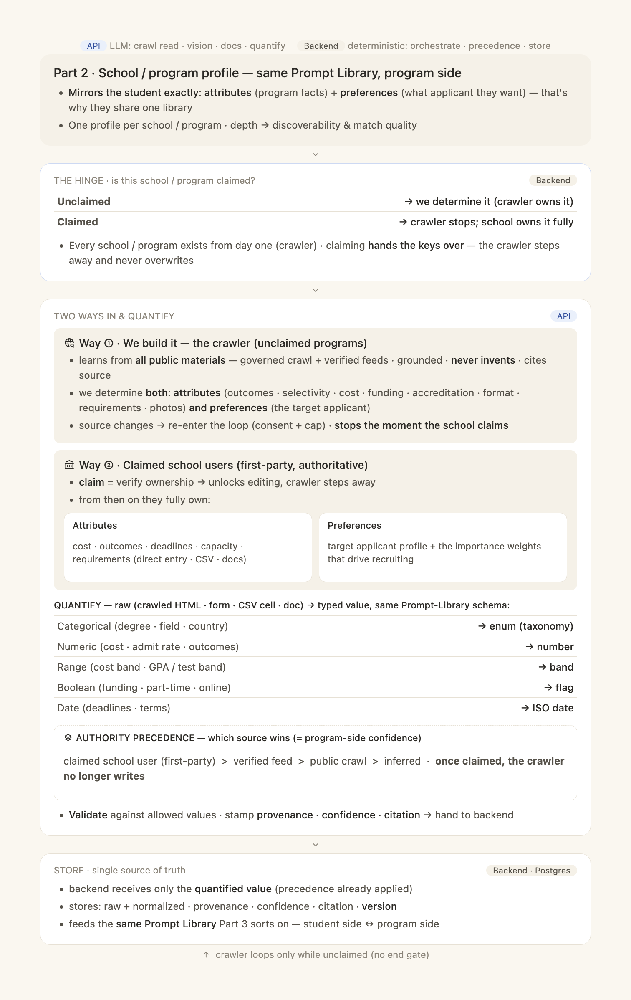
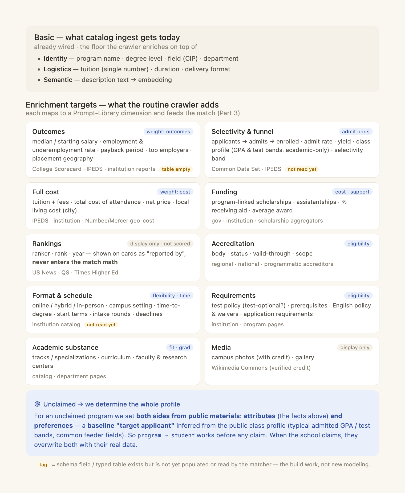

# AI Structure · Spec 2 of 3 — School / Program Profile

> **Part 2 of the three-part "AI Structure" architecture.** Sibling specs:
> - Spec 1 — Profile Enrichment Engine, student side (`2026-06-17-ai-structure-1-profile-enrichment-design.md`)
> - Spec 3 — Match Engine (`2026-06-17-ai-structure-3-match-engine-design.md`)
>
> The program side fills the **same Prompt Library** as the student side, so Spec 3 can compare them.
> **Self-contained:** every field, source, authority rule, flag, endpoint, and task needed to build Part 2 is here.

---

**Goal:** Build and maintain one profile per school / program — `{attributes, preferences}`, typed to the same Prompt Library as students — two ways: **we build it via the crawler** (the default, for every school/program from public materials), and **claimed school users** who then own and edit it. When a school claims, the crawler **stops** and never overwrites first-party data.

**Architecture:** A claim **hinge** splits ownership. Unclaimed → the **crawler** (governed, public, grounded-never-invents) determines *both* attributes and preferences. Claimed → first-party school users own it (program editor / CSV / docs) and the crawler steps away. The **API** (LLM) reads crawled HTML / docs / vision and quantifies raw→typed; the **backend** (deterministic) applies **authority precedence**, stamps provenance + confidence + citation, and stores. Authority precedence *is* the program-side confidence consumed by Spec 3.

**Tech stack:** same as Spec 1. Crawler lives under `unipaith-backend/src/unipaith/services/crawler/`; catalog ingest under `services/catalog/ingest_service.py`; typed outcomes in `models/outcomes.py`; program/school/institution in `models/institution.py`.

---

## 1. Current state (grounded — read before building)

- **Crawler engine is OFF.** `crawler_engine_enabled=False` (config.py:662) and `ai_crawler_extraction_v2_enabled=False` (config.py:547). Today program data arrives via **catalog ingest / data-upload** (`CatalogIngestService`) or editorial entry — *not* live crawl.
- **Crawler tables were dropped** in migration `f1a9c0d2e3b4` (enrichment_records, extracted_programs, crawl_schedules, source_url_patterns, crawl_jobs). The **network-free helpers remain**: `SourceExtractionAgent`, `DomainSchema`, `Normalizer`, `schemas.py`, `extractor.py` (used by the ML eval harness today). Re-enabling the crawler means restoring the fetch/orchestrate/write path on top of these helpers.
- **Reference tables exist and are bulk-seeded** (one-shot, not per-program live crawl): `ref_occupations`, `ref_tests`, `ref_visas`, `ref_geo_cost`, `ref_majors`, `ref_rankings`, `ref_accreditation`, `scholarships` (schemas.py:30-137, reference.py).
- **Typed outcome tables exist but are EMPTY and unread:** `ProgramOutcome`, `SchoolOutcome` (outcomes.py:151-249), `ProgramAdmissionsHistory` (outcomes.py:194; `selectivity_band` enum; academic-only `ALLOWED_CLASS_PROFILE_KEYS` outcomes.py:89-110).
- **Per-field provenance exists:** `Program.field_provenance` JSONB (institution.py:304), `ProvenanceMixin` (crawler.py:63-80) — `source`, `source_url`, `confidence`, `source_count`, `fetched_at`, `status`.
- **Authority order already defined:** `seed < crawled < corroborated < first_party < institution_verified` (crawler.py:50-60; catalog authority crawled<corroborated<editorial<first_party<institution_verified, ingest_service.py). **First-party is never overwritten.**
- **No program "preferences" / target-applicant fields exist** — this is a **gap** to add (§4).
- **No formal "claim" of a school/program exists** beyond `Institution.admin_user_id` (the institution owner; `require_institution_admin`). A claim link + claimed flag is **new** (§4).

> **Build implication:** "what more to crawl" is mostly **populating fields the schema already has** (outcomes, admissions, format) plus **re-enabling the crawler** and **adding program preferences + claim**.

---

## 2. Concept — the program side of the shared Prompt Library

The program profile mirrors the student exactly: `{attributes, preferences}`, each field typed (Categorical / Numeric / Range / Boolean / Date / Text) with confidence · provenance · version. Spec 3 compares student preferences ↔ program attributes (one direction) and program preferences ↔ student attributes (the other).

### 2.1 Program-side field catalog

**Attributes (what students match on)** — grounded in `models/institution.py` + `models/outcomes.py`:

| Field | Type | Home | State |
|---|---|---|---|
| program name | Text | `Program.program_name` | ✅ |
| degree level | Categorical | `Program.degree_type` | ✅ |
| field / CIP | Categorical | `Program.cip_code` | ✅ |
| tuition | Numeric | `Program.tuition` | ✅ scalar only |
| full cost (fees · total · net · living) | Numeric/Range | `Program.cost_data` + `ref_geo_cost` | ⚠️ stored, not read |
| delivery format | Categorical | `Program.delivery_format` | ⚠️ stored, not read |
| campus setting | Categorical | `Program.campus_setting` | ⚠️ stored, not read |
| duration / time-to-degree | Numeric | `Program.duration_months` | ⚠️ stored, not read |
| deadlines · intake rounds | Date | `Program.application_deadline`, `intake_rounds` | ✅/⚠️ |
| requirements · test policy · English policy | Boolean/Categorical | `requirements`, `application_requirements`, `english_policy` | ⚠️ |
| selectivity · admit rate · yield · class profile | Numeric/Range | `Program.acceptance_rate`, `ProgramAdmissionsHistory` | ⚠️ empty/unread |
| outcomes (salary · employment · payback · employers · placement) | Numeric/JSON | `ProgramOutcome` | ⚠️ empty/unread |
| funding · scholarships · assistantships | Boolean/Numeric | `scholarships` (FK), funding fields | ⚠️ |
| tracks / specializations · curriculum · faculty | Text→structured | `Program.tracks`, `School.about_detail` | ⚠️ |
| accreditation | Categorical | `ref_accreditation` | ✅ ref |
| campus photos / media | media | `School.media_urls`, `school_outcomes.campus_photos` | ✅ display-only |
| rankings | (display only) | `ref_rankings`, `Institution.ranking_data` | **not scored** (see Spec 3) |
| description | Text | `Program.description_text` → `embedding` | ✅ |

**Preferences (what applicant the program wants)** — **NEW** (§4): a `ProgramPreference` mirror of `StudentPreference`:
- target applicant profile (preferred GPA / test bands, preferred fields/backgrounds, target degree level) — Range/Categorical
- recruiting importance weights (0–10): academic-strength · field-fit · outcomes-alignment · funding-need-tolerance · geographic-target — Weight

---

## 3. The claim hinge + two ways in

### 3.1 Hinge (backend)
| State | Behavior |
|---|---|
| **Unclaimed** | crawler builds & maintains the whole profile (attributes + preferences) |
| **Claimed** | crawler **stops** writing; school users own it fully; first-party never overwritten |

Every school/program exists from day one via the crawler; claiming **unlocks editing and hands the keys over** — it is never required to appear in results.

### 3.2 Way ① — the crawler (unclaimed)  · API reads, backend stores
- Learns from **all public materials** — governed crawl + verified feeds; **grounded extraction never invents**; cites source.
- Determines **both** attributes (the §2.1 list) **and** preferences (the derived target-applicant, §3.4).
- Source change → re-enter loop (consent + cap, `change_events` / `ChangeEvent` crawler.py:192-234, currently unwired). **Stops the moment the school claims.**

### 3.3 Way ② — claimed school users (first-party)
- **Claim = verify ownership** → unlocks editing; crawler steps away.
- They own **Attributes** (cost · outcomes · deadlines · capacity · requirements — via program editor / CSV upload / docs) and **Preferences** (target applicant + recruiting weights).

### 3.4 Derived preferences for unclaimed programs
From the public **class profile** (`ProgramAdmissionsHistory.class_profile`, academic-only keys: GPA bands, test bands, common feeder fields, `selectivity_band`), derive a **baseline "target applicant"** so the `program → student` direction (Spec 3) works *before* any claim. On claim, the school overwrites it. Deterministic; no fabricated facts (omit when unknown).

### 3.5 The enrichment data map (what the crawler collects)
The crawler populates the full profile, not just the basics. Each target maps to a Prompt-Library dimension consumed by Spec 3:

| Domain | Fields | Source | Note |
|---|---|---|---|
| Outcomes | salary (median/start) · employment · underemployment · payback · top employers · placement geo | College Scorecard · IPEDS · institution | `ProgramOutcome` empty → populate |
| Selectivity & funnel | applicants→admits→enrolled · admit rate · yield · class profile (academic-only) · selectivity band | Common Data Set · IPEDS | `ProgramAdmissionsHistory` empty → populate |
| Full cost | tuition+fees · total CoA · net price · local living cost | IPEDS · institution · Numbeo/Mercer (`ref_geo_cost`) | extend beyond scalar tuition |
| Funding | scholarships · assistantships · % aid · avg award | gov · institution · aggregators (`scholarships`) | link to program |
| Accreditation | body · status · valid-through · scope | accreditors (`ref_accreditation`) | eligibility |
| Format & schedule | online/hybrid/in-person · campus setting · time-to-degree · terms · intake · deadlines | institution catalog | wire to matcher |
| Requirements | test policy · prerequisites · English policy/waivers · application reqs | institution / program pages | |
| Academic substance | tracks/specializations · curriculum · faculty & research centers | catalog · dept pages | grad fit |
| Media | campus photos (with credit) · gallery | Wikimedia Commons (verified credit) | display-only |
| **Rankings** | ranker · rank · year | US News · QS · THE | **display-only · never scored** |

### 3.6 Quantify + authority precedence (API + backend)
Raw (crawled HTML / form / CSV cell / doc) → typed value to the same Prompt-Library schema (enum · number · band · flag · ISO date). Then **authority precedence** picks the winner and *is* the program-side confidence `c_program` used by Spec 3:

| Source | wins over | `c_program` anchor |
|---|---|---|
| claimed school user (first-party) | everything | **1.0** |
| verified feed | crawl, inferred | **0.85** |
| public crawl | inferred | **0.6** |
| inferred (derived) | — | **0.4** |

**First-party is never overwritten.** Once claimed, the crawler no longer writes. Validate against allowed values; stamp provenance + confidence + citation (`Program.field_provenance`, `ProvenanceMixin`).

---

## 4. Data model changes

**New:**
1. **`ProgramPreference`** table (mirror of `StudentPreference`): `program_id` FK, target GPA/test bands (Range), preferred fields (ARRAY), target degree level, recruiting weights (Integer 0–10), `source`/`confidence`/provenance. Migration: `make migration MSG="add program_preferences"`.
2. **Claim / ownership:** add `claimed_at`, `claimed_by_user_id`, `is_claimed` to `School` and `Program` (or a `program_claims` link table). Claiming verifies ownership against `Institution.admin_user_id`. While `is_claimed`, the crawler write-path must no-op on first-party fields.
3. **Re-enable crawler write path** on the surviving helpers: restore source registry + fetcher + orchestrator + enrichment write (the parts dropped in `f1a9c0d2e3b4`), gated by `crawler_engine_enabled`. Grounded extractor must keep its "never invents" verification (§15).

**Wire (already exists, currently empty/unread):**
4. Populate `ProgramOutcome`, `ProgramAdmissionsHistory`, `SchoolOutcome` from crawl/feeds.
5. Extend catalog ingest to populate full cost, format/schedule, requirements, funding — stamping `field_provenance`.

**Flags:** `crawler_engine_enabled`, `ai_crawler_extraction_v2_enabled`, `crawler_live_fetch_enabled` (all currently OFF) — flip per-environment once the write path + grounding are proven.

> **Standing rules:** never `metadata.create_all()` in migrations; single Alembic head; update response schemas in the same change; verify DB field names before reading.

---

## 5. API endpoints

| Method · path | Purpose | Guard |
|---|---|---|
| `POST /institutions/me/claims` | claim a school/program → verify ownership, set `claimed_*`, stop crawler | `require_institution_admin` |
| `PUT /institutions/me/programs/{id}` | edit attributes (existing program editor) | institution admin |
| `PUT /institutions/me/programs/{id}/preferences` | edit recruiting preferences (**new**, writes `ProgramPreference`) | institution admin |
| `POST /institutions/me/programs/{id}/upload` | CSV / docs dataset upload (existing data-upload) | institution admin |
| crawler ops (system) | run/refresh crawl (existing `X-Ops-Token` guarded) | system token |

---

## 6. Implementation outline (tasks)
1. **`ProgramPreference` model + migration** + response schema + `PUT …/preferences`.
2. **Claim model** (`is_claimed`/`claimed_at`/`claimed_by_user_id` + `POST /claims`) and the **crawler no-op-on-claimed** guard.
3. **Re-enable crawler write path** on surviving helpers, behind `crawler_engine_enabled`; keep grounded-never-invents verification.
4. **Populate typed tables** — `ProgramOutcome`, `ProgramAdmissionsHistory`, `SchoolOutcome` ingestors from Scorecard/IPEDS/CDS feeds; stamp provenance/confidence/citation.
5. **Extend catalog ingest** for full cost · format/schedule · requirements · funding.
6. **Derived-preferences builder** (`services/crawler/derive_preferences.py`, new) from `class_profile` → baseline `ProgramPreference` for unclaimed programs; omit-never-guess.
7. **Authority-precedence write** — central helper that maps source→`c_program` and refuses to overwrite first-party.
8. **Tests** (§7).

## 7. Testing
- Authority precedence: claimed value never overwritten by crawl; source→`c_program` mapping correct.
- Claim flips ownership and the crawler write-path no-ops afterward.
- Derived preferences: built from `class_profile` only; absent class profile → no fabricated preference (omit).
- `ProgramPreference` round-trips; recruiting weights stored 0–10.
- Crawler grounded extraction: never writes a fact absent from source (reuse §15 verification test).
- Rankings ingested but flagged display-only (not added to any scored feature).

## 8. Out of scope
- The match math / two-sided confidence math → **Spec 3** (this spec only supplies `c_program` via authority precedence).
- The student side of the library → **Spec 1**.
- API tone / persona → founder-set.
