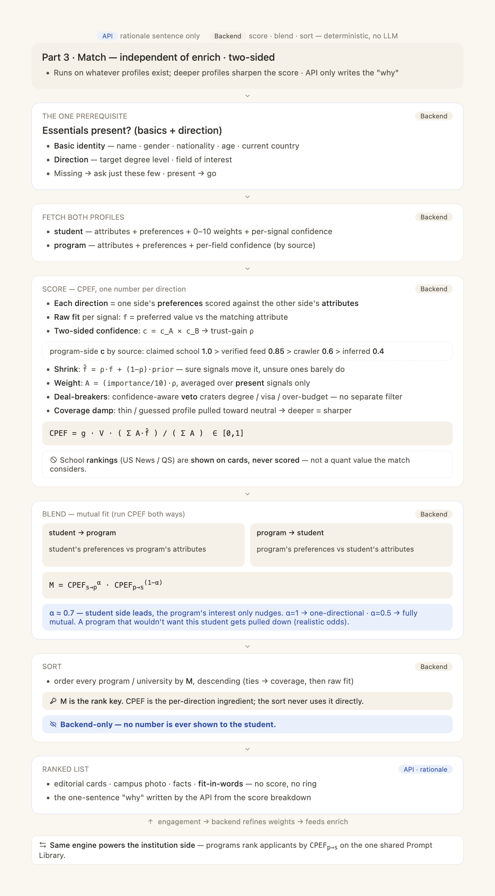

# AI Structure · Spec 3 of 3 — Match Engine (CPEF + mutual-fit blend)

> **Part 3 of the three-part "AI Structure" architecture.** Sibling specs:
> - Spec 1 — Profile Enrichment Engine, student side (`2026-06-17-ai-structure-1-profile-enrichment-design.md`)
> - Spec 2 — School / Program Profile (`2026-06-17-ai-structure-2-school-program-profile-design.md`)
>
> Spec 1 supplies `c_student`; Spec 2 supplies `c_program` (via authority precedence). This spec turns them into the ranking.
> **Self-contained:** the entire formula, every symbol, every per-type fit function, constants, worked examples, the mapping onto the existing `matching.py`, and tasks are all here.



---

**Goal:** Produce **one backend-only number per (student, program) per direction** — `CPEF` — that *fuses fit and data-confidence into a single value*, then **blend the two directions into `M`** and sort the whole catalog by `M`. Prompt values are the only determinant; deal-breakers are an in-formula veto (no separate filter); the student never sees a number.

**Architecture:** Deterministic Python, no LLM in the score. The **only** LLM (API) part is the one-sentence "why" written from the score breakdown for the ranked cards. `M` is the rank key; `CPEF` is the per-direction ingredient. Same engine runs the institution side (programs ranking applicants by `CPEF_{p→s}`).

**Tech stack:** Python 3.12 · the existing `unipaith-backend/src/unipaith/services/matching.py` + `match_service.py` + `program_features.py`. Calibrated against the existing NDCG@10 exit gate (`matching.py:59`).

---

## 1. Two key decisions (founder-locked)

1. **The backend ranks by `M`, not `CPEF`.** `CPEF` is computed per direction; `M` blends them. The sort only ever uses `M`.
2. **Fitness and confidence are ONE number.** Confidence is not a second output — it is the gain that decides how far each fit counts. (CPEF below.)
3. **School ranking is excluded from the math.** `ref_rankings` / `Institution.ranking_data` are shown on cards as "reported by" — never a scored value. `weight_ranking` is not read.
4. **Two-sided confidence.** Each dimension is only as trustworthy as both sides: `c = c_student × c_program`.

---

## 2. CPEF — Coverage-damped Posterior Expected-Fit (per direction)

For a given direction (say student→program), over the student's **present** signals `P`:

```
CPEF = g · V · ( Σ_{k∈P} A_k · f̂_k ) / ( Σ_{k∈P} A_k )           ∈ [0,1]

per signal k:
  f_k   ∈ [0,1]   raw fit: one side's preferred value vs the other side's attribute (typed, §3)
  c_k   = c_k^self · c_k^other          two-sided data-confidence  (∈ [0.01, 0.99] clamped)
  ρ_k   = τ_k / (τ_k + τ0),  τ_k = κ · c_k/(1−c_k)        trust-gain   (with τ0=κ ⇒ ρ_k ≈ c_k)
  f̂_k   = ρ_k · f_k + (1−ρ_k) · m_k     posterior-mean fit (fit ⊗ confidence, fused)
  A_k   = (w_k / 10) · ρ_k              attention weight (importance × confidence-gain)

veto + coverage:
  V  = Π_{d∈DB} ( 1 − ρ_d · (1 − v_d) )         confidence-aware deal-breaker veto  ∈ [ε,1]
  g  = ( n0 + Σ_{k∈P} A_k ) / ( n0 + Σ_{k∈P_full} (w_k/10) )    coverage damp  ∈ (0,1]

empty P ⇒ CPEF = g·V·0.5  (honest "don't know yet")
```

### 2.1 Symbol glossary
- `f_k` — raw per-signal fit, confidence-free (§3).
- `m_k` — program-specific **prior** (base-rate fit of a typical student to this program on dim k); default 0.5 only when no base rate is known. **Do not ship flat 0.5 everywhere** — precompute per-(program,dim) base rates offline in `program_features.py` (compresses early rankings otherwise).
- `c_k^self`, `c_k^other` — the two sides' data-confidence (Spec 1 `c_student`; Spec 2 `c_program` by authority: claimed 1.0 / verified 0.85 / crawler 0.6 / inferred 0.4).
- `ρ_k` — trust-gain ∈ (0,1); *this is confidence as a number* (confirmed≈0.9 / imported≈0.7 / inferred≈0.4).
- `f̂_k` — posterior-mean fit; the fused fit+confidence value that gets aggregated.
- `w_k` — importance weight 0–10 (student preference slider asked 0–5, stored 0–10); structural signals (degree, GPA-vs-admit, field) get a fixed `w_base` (≈5–8).
- `A_k` — effective weight; folds reliability into importance.
- `V` — deal-breaker veto; `DB = {degree-level, visa/eligibility, cost-far-over-budget}`; `v_d∈[ε,1]` (≈1 fine, ≈ε violated); `ε≈0.01`.
- `g` — coverage damp; `n0`≈3 soft saturation; =1 only when every signal present AND confirmed.
- `τ0=κ` — prior precision = precision scale (so ρ≈c); only the ratio matters.

### 2.2 Why it is ONE number
Confidence enters twice and inseparably — as the gain `ρ_k` inside each `f̂_k` (fit↔confidence fused per-signal) **and** as the reliability factor in `A_k` (a surer signal counts more). There is never a separate "fitness" and "confidence"; there is one computation that gets *sharper* as `c_k` rises. A displayable certainty, if ever wanted, is just the A-weighted mean of `ρ_k` — but the ranking never uses it.

### 2.3 Deeper profile ⇒ sharper ranking
As enrichment fills signals and upgrades tiers (inferred→imported→confirmed), each `ρ_k` rises, so each `f̂_k` decompresses off the prior toward the true fit → high cross-program variance → a sharply-ordered list. Thin/inferred profiles huddle near the priors → soft list. The coverage damp `g` additionally keeps a 2-signal "perfect" match from outranking a 12-signal strong one. Enrichment (Spec 1) and matching reinforce each other with no gate between.

---

## 3. Per-type fit functions `f_k` (all return [0,1])

| Type / dimension | Function |
|---|---|
| **Categorical** (field vs fields offered; learning style) | exact enum = 1; related = `sim(a,b)` from a curated CIP-family/similarity table (e.g. Data Science↔Statistics 0.8, ↔CS 0.7, same 2-digit CIP family 0.5); else 0 |
| **Numeric, higher-is-better vs cohort** (GPA vs admit median; test vs median) | `z = (x_student − μ_program)/σ_program`; `f = 1/(1+e^(−1.7z))` (logistic ≈ normal CDF). median→0.5, well above→1, well below→0; being far above never penalizes |
| **Numeric, preference-target** (desired time-to-degree vs program length) | Gaussian kernel `f = exp(−((x_s − x_p)/h)^2)`; exact→1, far→0; bandwidth `h` sets tolerance |
| **Range / budget** (budget_max vs tuition `c`) | `f=1` if `c ≤ budget_max`; mild overage `f = clamp(1 − (c−budget_max)/(δ·budget_max), 0, 1)`, `δ≈0.25`; beyond δ → `f=0` AND overage becomes the cost deal-breaker. Subtract expected aid first if funding need + program offers aid |
| **Boolean** (flexibility wanted = part-time/online; required support) | have-it → 1; else floor `f0` (0.0 hard want, 0.3 soft); want-strength rides in `w_k`, not `f` |
| **Geo-list** (preferred_countries `G` vs program locations `L`) | `f=1` if `G∩L≠∅` and primary location ∈ G; partial `|G∩L|/|L|` for multi-campus; 0 if disjoint. A hard "avoid" is a deal-breaker, not here |
| **Degree-level as fit** (right family) | exact level → 1; adjacent-acceptable → 0.6 (level-adjacency table); wrong family → veto, `f→0` |
| **Date** (deadline horizon; passport validity vs start) | comfortably feasible → 1; linear decay as margin shrinks; infeasible → soft penalty (not a hard filter). Compared as day-deltas, never language |

**Preference-weight → fit-dimension map** (the weight is `w_k`, the fit is computed by the function — never confuse them): cost→budget · location→geo · outcomes→numeric-higher-better · flexibility→boolean · support→needs/boolean · time→preference-target. **ranking → excluded** (display-only).

---

## 4. The mutual-fit blend → `M` (the rank key)

Run CPEF both directions and blend with a weighted geometric mean, student side leading:

```
M = CPEF_{s→p}^α · CPEF_{p→s}^(1−α)        α ≈ 0.7
    CPEF_{s→p} = student's preferences vs program's attributes
    CPEF_{p→s} = program's preferences vs student's attributes
```

- `α=1` → one-directional (student only) · `α=0.5` → fully mutual.
- A program that wouldn't want this student (low `CPEF_{p→s}`) is pulled down → realistic admit odds.
- **Sort** every program/university by `M` descending; ties → coverage `Σ A_k`, then raw `Σ f_k`.
- The **institution side** sorts applicants by `CPEF_{p→s}` directly (same engine, no blend needed there unless desired).
- `α` is a tunable in `DEFAULT_PARAMS`.

---

## 5. Worked examples (sanity)

*Program: MS Data Science, $40k net, NYC, masters. Constants τ0=κ (ρ=c), m=0.5, δ=0.25, n0=3, ε=0.01.*

| signal | f | c (two-sided) → ρ | f̂ = ρf+(1−ρ)·0.5 | A=(w/10)·ρ |
|---|---|---|---|---|
| cost (budget $35k vs $40k) | 0.44 | 0.90 | 0.45 | (9/10)·0.9 = 0.81 |
| field (DS=DS) | 1.0 | 0.70 | 0.85 | (5/10)·0.7 = 0.35 |
| location (USA ✓) | 1.0 | 0.40 | 0.70 | (4/10)·0.4 = 0.16 |

Inner = (0.81·0.45 + 0.35·0.85 + 0.16·0.70)/(0.81+0.35+0.16) = 0.771/1.32 = **0.584**. V=1 (no deal-breakers), g = (3+1.32)/(3+~7.2) = **0.42** → `CPEF ≈ 0.42·1·0.584`.

- **Confidence moves the one number:** flip field imported→inferred (ρ 0.7→0.4): f̂ 0.85→0.70, A 0.35→0.20 → inner **0.524** (down from 0.584). Fit unchanged; we just got less sure.
- **Deal-breaker:** confirmed visa-ineligible (ρ_d=0.9, v=ε): `V = 1−0.9·0.99 ≈ 0.109`, and the **hardened floor** caps a confirmed deal-breaker strictly below the minimum clean score → buried (~0.006). If only *inferred* (ρ_d=0.4): `V = 1−0.4·0.99 = 0.604` → penalized (~0.15), not buried.

> **Hardened floor rule:** for any *confirmed* deal-breaker, force the whole score strictly below the minimum achievable un-vetoed CPEF — so a confirmed true deal-breaker always ranks below every clean program, while low-confidence vetoes float as graded penalties.

---

## 6. Mapping onto the existing code (grounded)

Replace `matching.py::score()`:
- **Drop** the binary `rule_pass → fitness=0/eliminated` path AND the separate geometric-mean confidence block. Both collapse into one CPEF: `rule_pass` becomes the graded confidence-aware veto `V` (reuse `_education_compat` for degree; add `StudentVisaInfo` for visa; reuse the budget compare for cost). The confidence terms become the per-signal `ρ_k`.
- **Generalize `_renormalized_weights`** — it already drops absent components + renormalizes; extend so the denominator is `Σ_{k∈P} A_k` over present signals (`A_k=(w_k/10)·ρ_k`). All-present, all-confirmed ⇒ exact no-op (back-compat). This is the same class as the cosine-cap fix (the 0.55-cap bug) generalized to every signal.
- **Feed real confidence:** `StudentSignal.confidence` (int 0–100) ⇒ `c_student=confidence/100`; `StudentNeed/StudentGoal.confidence` `Numeric(3,2)` used directly; `source∈{discovery,manual,inferred}` maps to anchors only when no numeric confidence exists. `c_program` from Spec 2 authority precedence. Build `StudentFeatures`/`ProgramFeatures` with per-signal `{value, confidence, tier}`.
- **Weights** from `StudentPreference.weight_*` (Integer 0–10, nullable → `w_base`); map each slider to its fit dim (§3). Structural signals get `w_base`. **Do not read `weight_ranking`.**
- **Priors `m_k`:** precompute per-(program,dim) base rates offline in `program_features.py`; fall back to 0.5 only when unknown.
- **`match_service`:** keep `_fitness_band` thresholds (0.75/0.55/0.40) consuming the single `M` (or `CPEF_{s→p}`) as "fitness". `rank_programs` sort key collapses from `(fitness, confidence)` to `(M,)` with tie-breaks (coverage, raw fit). Persist the single number into both `fitness_score` and the legacy `match_score`; set `confidence_score` = A-weighted mean of `ρ_k` (derived transparency readout, not a sort key) until Phase E drops `match_score`/`score_breakdown` (migration `bd5c6e3f2a1b`).
- **Keep a fully-explainable breakdown dict** (per-signal `f_k, c_k, ρ_k, f̂_k, A_k`, each `v_d^eff`, `g`, both CPEFs, `M`) so the API rationale agent verbalizes the "why" without re-deriving.

**`DEFAULT_PARAMS`** (one dict, like `DEFAULT_WEIGHTS`): `κ/τ0` (τ0=κ), `δ=0.25`, `ε=0.01`, Gaussian `h`, logistic slope `1.7`, similarity tables, `w_base`, `n0=3`, `α=0.7`. These are the calibration levers against the NDCG@10 gate.

---

## 7. Determinism & properties
Pure Python; no LLM; bounded [0,1]; monotone in every `f_k` and directionally in every `ρ_k`; ranking-stable. A vetoed program is still *computed* (never NaN, never hard-dropped) — it just sinks.

## 8. Implementation outline (tasks)
1. `DEFAULT_PARAMS` dict + per-type `f_k` functions (§3) with unit tests per type.
2. Two-sided `c_k` + `ρ_k` + `f̂_k` + `A_k`; generalize `_renormalized_weights` to `Σ A_k`.
3. Confidence-aware veto `V` (degree via `_education_compat`, visa via `StudentVisaInfo`, cost ramp) + hardened-floor rule.
4. Coverage damp `g`; precompute priors `m_k` in `program_features.py`.
5. `CPEF(direction)` assembling 1–4; then `M` blend (§4) with `α`.
6. Rewire `match_service.rank_programs` to sort by `M`; persist `fitness_score`/`match_score`=M, `confidence_score`=mean ρ; keep `_fitness_band`.
7. Explainable breakdown dict → feed the existing API rationale agent (`ai_match_rationale_v2_enabled`).
8. Calibrate `DEFAULT_PARAMS` against NDCG@10 (`matching.py:59`); regression-test rank stability.

## 9. Testing
- Each `f_k` type: boundary values (exact, far, disjoint, over-budget ramp).
- Confidence monotonicity: lowering a signal's `c` moves `M` toward the prior (the §5 worked drop).
- Deal-breaker: confirmed → buried below every clean program (hardened floor); inferred → graded penalty.
- Missing signals drop from both sums (no phantom-zero; the 0.55-cap regression test).
- Two-sided: a crawled (0.6) program attribute caps the dimension's `ρ` below the student-only value.
- Blend: `α=1` reproduces one-directional; lowering `CPEF_{p→s}` lowers `M`.
- Ranking is never added to any feature (grep guard) — display-only.
- Backend-only: no score field is serialized to the student match response (only band + rationale).
- NDCG@10 ≥ the pre-change baseline on the eval set.

## 10. Out of scope
- Student-side library/enrichment → **Spec 1**. Program-side profile/crawler/claim → **Spec 2**. API tone → founder-set.
