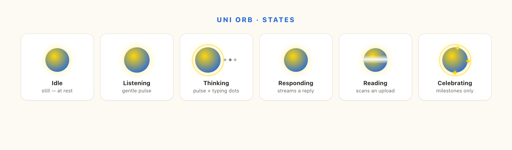
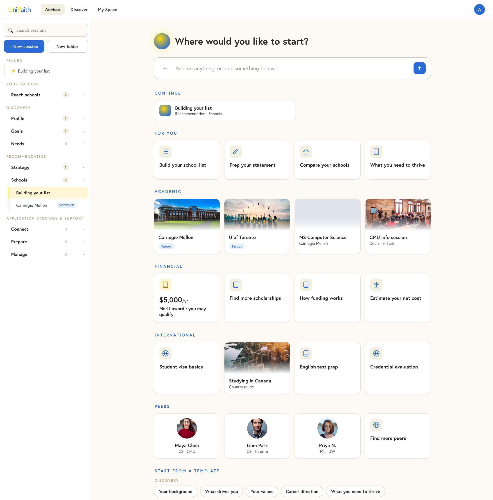
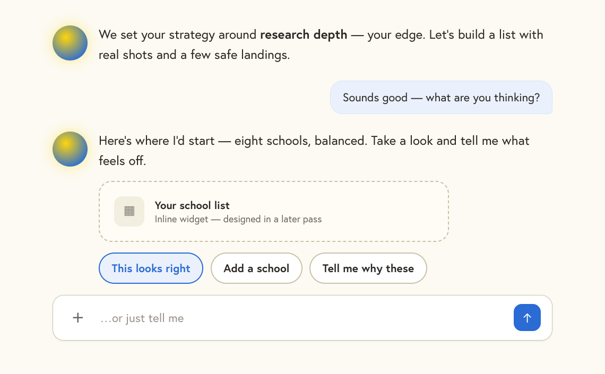

# Uni Chat Tab — Redesign Design Spec

**Date:** 2026-06-19 · **Status:** Brainstorm complete (visual companion), spec for implementation · **Surface:** `/s` (the student app's home — "Advisor"/Uni) · **Route source:** `frontend/src/pages/student/discover/UniConversation.tsx` (+ siblings) is the current implementation being replaced.

> Brainstormed live as ~12 iterated mockups in the visual companion (`.superpowers/brainstorm/*/content/chat-*.html`). Those HTML files are visual prototypes, not production code — this spec is the authoritative description.

---

## 0. The model (grounded in the White Paper)

UniPaith for students is **"everyone's private college counselor"** — it replicates a real counselor's workflow. The founder's White Paper (`/Users/leozhu/Desktop/工作/UniPaith/Master Paper.docx`, "Business White Paper") defines a **three-stage** advisor workflow:

1. **Discovery** — Profile (Basic → Personality → Identity), Goals (SMART: Academic / Social / Personal), Needs (Maslow).
2. **Recommendation** — a broad **Strategy**, then a **school / program list** (with Fitness + Confidence).
3. **Application Strategy & Support** — Connection / Outreach, **Prepare** (essay/interview workshops, test guides — feedback-only, never content-generating), **Manage** (application tracking, calendar, checklist, status).

**Architecture principle (founder, this session):** the durable, structured profile (strategy · school list · preferences · all the "massive fields") lives in **My Space**. **The chat tab's job is to help the student fill those fields** through counselor-led conversation. The chat is the warm engine; My Space is the structured home; the two are the same data seen two ways.

**Interaction principle:** not a rigid wizard (people feel tested), not an open blank LLM (people freeze). Uni **leads one focused thing at a time and always offers a few next moves**, while the structure (the "map"/"repo" of topics) is provided and the *path through it is user-driven* — like a coding LLM that hands you a repo and guides how to start a session in it.

---

## 1. Uni's presence — the orb

A single brand element represents Uni; **there is no name label and no avatar/monogram** in the UI ("Uni" is de-branded per the 2026-06-14 brief).

- **Form:** an **aura orb** — a circular `radial-gradient(circle at 38% 34%, gold, cobalt 80%)` disc (the *one* sanctioned gradient; the brand's "no gradients" rule is waived only for the AI identity).
- **Motion = meaning. Idle is completely still** (no breathing at rest), so the surface feels calm until something happens. Motion appears only with activity.
- **States** (each a distinct animation):
  | State | Cue |
  |---|---|
  | Idle | still |
  | Listening | gentle slow pulse (user typing) |
  | Thinking | faster breathe + gold pulse-ring + typing dots (Claude-style "loading a reply") |
  | Responding | medium breathe while text streams (blinking cursor) |
  | Reading | a light scan sweeps the orb (ingesting an upload) |
  | Saved | brief green flash |
  | Celebrating | gold sparkle — **real milestones only** |
  | Clarifying | a soft wobble (asking a follow-up) |
  | Error | desaturates, calm and courteous |
- **Energy:** lively but refined — a turn's entrance animates **once** (no looping); brand-faithful, never gimmicky.



---

## 2. Shell & layout

**Full-window** (full-bleed, fills the viewport — per CLAUDE.md app-shell rule). Three parts:

```
┌───────────────────────────────────────────────────────────┐
│  nav: wordmark · Advisor / Discover / My Space · avatar    │
├──────────────┬────────────────────────────────────────────┤
│ LEFT          │  CENTER                                     │
│ session       │  ── new-session screen  (default when no    │
│ browser       │      active session / "+ New session")      │
│ (intelligent) │  ── conversation        (an active session) │
└──────────────┴────────────────────────────────────────────┘
```

- **nav** is a slim app bar (real UniPaith wordmark: gold caps `U`/`P`, cobalt lowercase). Responsive: the left rail collapses below ~860px.
- The center holds **two views** — the **new-session screen** (§4) and the **conversation** (§5) — swapped, never both.

---

## 3. Left rail — the intelligent session browser

The left is **not a fixed journey/checklist** (rejected: felt like a graded test). It is an **intelligent session browser**, organized by the White-Paper structure, that the user manages like a normal LLM platform.

### 3.1 Structure

- **Folders = White-Paper topics** (the "map"/"repo" we provide), grouped under the three stage labels: *Discovery* (Profile · Goals · Needs) · *Recommendation* (Strategy · Schools) · *Application Strategy & Support* (Connect · Prepare · Manage). These are **preset and protected** — they cannot be deleted or (recommended) renamed; they are the canonical backbone.
- **Sessions** (named conversation threads) live **inside a folder**. A folder may hold many sessions.
- **Custom folders** — the user may create their own folders (`+ New folder`); these *can* be renamed and deleted.
- **Pinned** — a section at top for pinned sessions.
- **Search** — over the user's sessions.
- **`+ New session`** (primary) + **`New folder`** (secondary) at the top.

### 3.2 Intelligence (the "not just a list" requirement)

- **Auto-categorization:** a user-created or context-spawned session is **filed into the right folder by the system**, not the user. (Example shown: typing "How do I pay for this?" in New session → filed under *Needs → Funding*.)
- **Context-spawned sessions:** actions elsewhere in the app create sessions here — e.g. clicking a program in Discover opens a "Carnegie Mellon" session under *Schools*, tagged with its origin ("from Discover").
- **Surfacing:** *Continue* (resume the active thread) and *Suggested next* are computed, not authored. (In the chat tab these live on the new-session screen, §4 — not crowding the rail.)

### 3.3 Controls (like a normal LLM platform)

- **Session ⋯ menu:** Rename · Pin · Delete. **No "Move to…"** — folder placement is owned by the intelligent browser, not the user.
- **Preset-folder ⋯ menu:** New session here · Collapse. **No delete, no rename.**
- **Custom-folder ⋯ menu:** Rename · New session here · Delete folder.
- **Drag to reorder, constrained:** a user may reorder **sessions within a folder** and reorder **folders within their group**, but **cannot drag a session into a different folder** (auto-categorization owns that). A **grip handle** fades in on hover (left gutter) as the affordance; grab/grabbing cursors.

---

## 4. New-session screen (the launcher)

Shown by default and on `+ New session`. ChatGPT-style empty state, but organized by the **product's own categories** and rich with diverse cards.

- **Hero:** the orb + `Where would you like to start?` (no grey subtitle/commentary).
- **Input bar:** free text ("Ask me anything…") with **`+` upload** on the left (§6) and a cobalt send. Free text is auto-categorized into a session.
- **Sections — follow the product taxonomy** (mirrors the Discover hub IA): **Continue · For you · Academic · Financial · International · Peers · Templates.** Cards are **uniform within each section** (organized, not a crowded mixed grid); diversity lives *across* sections.
- **Diverse card types** (cover the whole product, not just profile-building):
  - **Action cards** — icon + title (Build your school list · Prep your statement · Find scholarships · Compare your schools).
  - **Visual cards** — campus/program **photos** + name + tag (schools as Target/Reach, programs, events).
  - **Scholarship cards** — gold-accented, amount + name.
  - **Peer cards** — avatar photo + name + program ("profile cards with pics").
  - **Guide/info cards** — visa basics, how funding works, etc.
- **Templates** — preset session starters grouped by the three stages, shown as chips. **Placeholder for now** — see §8.2.



---

## 5. The conversation

Counselor-led, warm, one topic per turn.

- **Turn:** orb (state-aware) + the advisor's message as **plain text** (no bubble), in counselor voice. The **user's** messages appear as a soft **cobalt-tint** bubble, right-aligned (never dark/black).
- **Steering chips** — after a turn, a small "We could…" set of next moves, so the user is guided but never boxed in.
- **Inline content** — when the advisor produces something (a plan, a list), it appears **inline as a warm card in the flow** (not a separate dashboard panel — a persistent right-side CRM was explicitly rejected). The interactive **widgets** that fill profile fields also render here. *(Widget design is deferred — see §8.1; the mockup uses a labeled placeholder.)*
- **Statuses** are visible during a turn (Thinking… / Reading your file…) with the matching orb state.
- **Composer** — text input + the **`+` upload** + cobalt send. The text escape hatch is always available.
- **Answered turns** may collapse into a tidy trail (from the one-topic-per-turn brief); the durable record lives in My Space.



---

## 6. Upload ("+") — like any LLM

- A clean, **borderless `+` icon** button (subtle grey, hover-tints cobalt) on both the new-session input and the chat composer. *(Not a boxed/bordered button.)*
- Opens an LLM-style menu: **Upload a file · Add a photo · From My Space.**
- On upload, Uni enters the **Reading** state (scan over the orb) and folds the result into the profile. Reuses the existing material-ingest pipeline (`ai/material_ingest.py`, `services/material_ingest_service.py`, `api/materials.py`, flag `ai_material_ingest_v2_enabled`) — native PDF/image + docx2txt, never fabricates.

---

## 7. Voice & content rules (UX-QA)

- **Advisor, not parent/teacher.** No grading, no "you haven't done this yet," no hand-holding. Areas are entered in any order; everyone reaches the same goal by different paths.
- **No grey commentary.** Cut explanatory subtitles, "here's what this does" lines, and filler. Keep functional metadata only (a school's tier, a program's school, an event date).
- **Counselor voice** — warm, calm, professional, collaborative ("we"/"let's"); acknowledge before asking; one real question per turn; never interrogate. (Mirrors `unipaith-backend/src/unipaith/ai/prompts/_shared/uni_counselor.md`.)
- **Earned warmth only** — bare "Saved"; celebration (sparkle) reserved for real milestones.
- Follows `docs/UX-QA.md`; reusable strings in `frontend/src/lib/copy.ts`; passes `npm run voice-lint`.

---

## 8. Brand & visual system

Follow `Spec/01-brand-tokens.md` / `frontend/src/index.css` tokens — **do not hardcode hex** in the build.

- **Editorial duotone:** paper cream `#FCFAF2` is the canvas; **sunlit gold `#FFD60A` is punctuation, earned (≤~10% of a screen)**; **cobalt `#2A6BD4` is the workhorse accent** (buttons, links, active states); **soft ink `#2A2724`** for text (never pure black).
- **Type:** **Europa only** (Adobe Typekit kit `spe3ioy`), hierarchy by size/weight/tracking. Eyebrows uppercase 12px/700/0.22em.
- **Radii:** cards 14px · controls 10px · chips pill. **Elevation:** the three documented tiers only (subtle/raised/glow), **ink-tinted, never grey**. **No gradient backgrounds** except the orb.
- **Icons:** `lucide-react`, 1.5px stroke, `currentColor`.

---

## 9. Out of scope — explicit follow-on work

This spec covers the **chat-tab shell, the session browser, the new-session launcher, the conversation frame, and the visual/voice system.** Three pieces are deliberately deferred and get their own design/spec passes:

### 9.1 The widget library (deferred — own design pass)
The interactive widgets that render inline in a turn to **fill the Prompt-Library fields**, reusable across the chat *and* My Space. Catalog = the `enrichment_planner.py` CATALOG (23 typed fields across 7 `ask_kind`s: choice · multi · scale · number · range · date · text). The chat-tab spec only reserves the inline slot (a placeholder today). **Founder will signal when to design these.**

### 9.2 New-session templates (deferred)
Templates must be **more than keywords fed to the API** — each is a structured, guided flow (a real session scaffold), not just a search string. Today they are placeholder chips. Needs its own design: what a template *contains*, how it seeds a session, and how it routes into the agent.

### 9.3 Backend alignment (deferred — the founder's day-1 ask)
Confirm the API follows the 2026-06-17 AI-Structure outcome and works with the LLM backend:
- **Enrichment contract** — `GET /me/enrichment/next`, `POST /me/enrichment/{field}/value` (`services/enrichment_service.py`, `enrichment_planner.py`) feed the widgets and the profile.
- **Managed agent** — Uni runs as a managed agent on platform.claude.com (`services/uni_agent_host.py`, `services/uni_tools.py`, flag `ai_uni_managed_agent_v1`); the host adapts the agent's tool contract. The streaming SSE contract (`/me/discovery/.../messages/stream`, `/me/discovery/opener/stream`) drives the conversation.
- **LLM backend** — extraction/feature emit route to self-hosted **Qwen** (vLLM, `ai/boundary.py`); human-facing stays **Claude**. Verify the boundary + failover.
- **NEW data model (the biggest backend gap):** the current chat is a single discovery conversation (`discovery_sessions` per track). This design needs a **multi-session, foldered, named, auto-categorized** model — a new `sessions` concept (sessions ↔ White-Paper topic folders ↔ custom folders ↔ pin/order), session auto-categorization, and context-spawn from elsewhere in the app. This is net-new and should be specced before implementation.

---

## 10. Open questions

- **Sessions persistence model** — schema for sessions/folders/order/pins; how auto-categorization is computed (deterministic mapping vs. LLM); migration from the single discovery conversation.
- **Continue / Suggested-next ranking** — what drives these surfaces.
- **New-session content sources** — Academic/Financial/International/Peers cards pull from Discover data (universities, scholarships, intl, peers/connect); confirm those endpoints exist and are wired.
- **Answered-trail vs. session history** — how much of a thread shows inline vs. lives in My Space.
- Founder confirm: preset folders truly un-renameable (recommended), or rename-allowed?

---

## 11. Mockup references

`.superpowers/brainstorm/<session>/content/`: `chat-tab-v10/v11/v12.html` (final locked chat tab), `circle-color-states-v2.html` (orb + states), `uni-circle-A-final.html` (idle-still), earlier `chat-warm` / `chat-structured-warm` (warmth + structure evolution). These are visual prototypes only.
